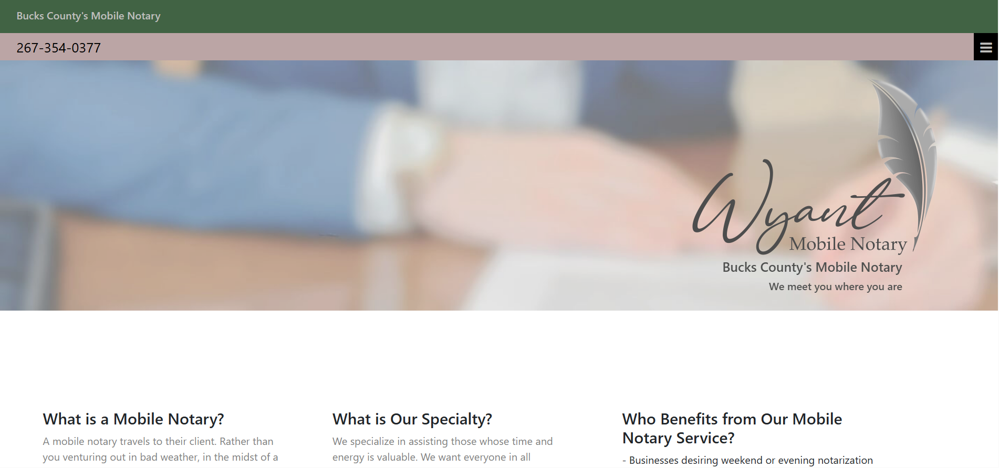

# Wyant Mobile Notary

- [Overview](#overview)
  - [Screenshot](#screenshot)
  - [Links](#links)
- [My process](#my-process)
  - [Built with](#built-with)
  - [What I learned](#what-i-learned)
  - [Continued development](#continued-development)
  - [Useful resources](#useful-resources)
- [Author](#author)
- [Acknowledgments](#acknowledgments)

## Overview
- An informative mobile notary website to connect clients to a local notary. CSS and HTML are the main languages.

### Screenshot

### Links
- Solution URL:
  https://github.com/Dev-Wy/Wyant-Notary
- Live Site URL:
  https://dev-wy.github.io/Wyant-Notary
- Live Site WebPage:
  https://wyantnotary.com/

## My Process
### Built with
- HTML
- CSS
- JavaScript
  
### What I learned
- This was my first time working with FileZilla, NameCheap, and any website not hosted on GitHub Pages. I learned a great deal about the web hosting process as well as what it takes to make updates.

### Continued development
- I'd like to add a scheduling calendar and a contact section with comment sections connect to the owner's email.

### Useful Resources: 
- I love W3C School's validation services. 
- https://validator.w3.org/   
- https://jigsaw.w3.org/css-validator/

## Author
- Jake Wyant
- Portfolio: https://dev-wy.github.io/Portfolio/
- LinkedIn: https://www.linkedin.com/in/jakewyantdeveloper/

## Acknowledgments 
- Special thanks to Skillcrush for giving me the foundation to build on.
